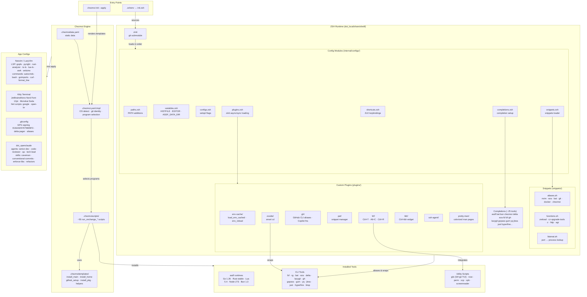

# AI Documentation — dotfiles (chezmoi)

> Auto-generated on 2026-05-24. Do not edit manually — regenerate with `/repo-doc`.

## Overview

Personal dotfiles repository for Pedro Campos, managed by [chezmoi](https://www.chezmoi.io/). It provisions a full Linux developer environment: ZSH shell runtime (plugins, aliases, completions), Neovim (LazyVim), Kitty terminal, Claude Code AI assistant config, and ~55 tool-installation scripts. Supports Debian/Ubuntu (apt) and Fedora (dnf); also handles WSL. Templates are written in Go text/template with [sprig](https://masterminds.github.io/sprig/) helpers.

## Tech Stack

| Layer | Technology |
|-------|------------|
| Dotfiles manager | chezmoi (Go templates + sprig) |
| Shell | ZSH + zinit plugin manager |
| Terminal | Kitty |
| Editor | Neovim (LazyVim, Lua) |
| Runtimes (asdf) | Go 1.26, Rust stable, Lua 5.4, Node LTS, Bun 1.3 |
| AI tooling | Claude Code, OpenClaude |
| Package tools | apt (Debian/Ubuntu/WSL), dnf (Fedora) |
| Deploy | `chezmoi init --apply <repo>` |

## Repository Layout

```
chezmoi/
├── .chezmoi.yaml.tmpl          # Main config: interactive init, OS detection, program selection
├── .chezmoidata.yaml           # Static data loaded after .chezmoi.yaml.tmpl
├── .chezmoiignore              # Files chezmoi skips (docs/, tools/, README, etc.)
├── .chezmoiscripts/            # ~55 run_onchange_* install scripts (one per tool)
├── .chezmoitemplates/          # Reusable template fragments (helpers, install loops, github)
├── .github/                    # Issue templates + PR template
├── dot_cargo/env               # Cargo (Rust) env sourced on shell init
├── dot_claude/                 # Claude Code config (symlinks to dot_openclaude)
├── dot_config/
│   ├── distrobox-home/         # Distrobox container zshrc + config symlink
│   ├── kitty/                  # Kitty terminal config + hints scripts
│   ├── lazygit/                # Lazygit empty config
│   └── nvim/                   # Neovim: LazyVim-based Lua config + LSP configs
├── dot_gitconfig.tmpl          # Git config template (name, email, signing key)
├── dot_golangci.yml            # golangci-lint config
├── dot_lefthook.yaml           # Lefthook git hook runner config
├── dot_local/
│   └── share/
│       ├── fonts/n/            # Nerd Font files (Symbols)
│       └── shell/              # ZSH runtime (see Shell Runtime section)
├── dot_openclaude/             # Claude Code / OpenClaude agent, skill, command configs
├── dot_ssh/allowed_signers.tmpl # SSH allowed signers for commit verification
├── dot_tool-versions           # asdf tool version pins
├── dot_zshenv.tmpl             # .zshenv: sources shell init, PATH additions
├── gnometilingshell-layouts.json # GNOME tiling shell layout config
└── tools/
    ├── Containerfile           # Toolbx container definition
    ├── docker_mcp_profile-dev_tools.json
    └── scripts/                # Helper scripts: gitx, now, perm, screenreader, xcp, xpb
```

## Package / Module Map

### `.chezmoiscripts/`

**Role:** cmd — install scripts, each named `run_onchange_<tool>.tmpl`  
**Exported symbols:** one shell script per tool, rendered via `chezmoi execute-template`  
**Key scripts:** `install-asdf`, `install-nvim` (sudo), `install-zsh` (sudo), `install-kitty`, `install-bun`, `install-fzf`, `install-rg`, `install-delta`, `install-lazygit`, `install-gh`, `install-gopass`, `install-toolbx`, `install-ai`, `setup-nautilus-scripts`, `tools_scripts_gitx/xcp/xpb/now/perm/screenreader`  
**Depends on:** `.chezmoitemplates/` (install_main, install_home, install_pkg, helpers)

### `.chezmoitemplates/`

**Role:** config — reusable template fragments  
**Files:** `helpers.tmpl` (utility macros), `install_main.tmpl` (install to `/usr/local/bin`), `install_home.tmpl` (install to `~/.local/bin`), `install_pkg.tmpl` (single package install via apt/dnf), `install_pkgs_loop.tmpl` (batch package install), `github_setup.tmpl` (GitHub release download helper)

### `dot_local/share/shell/`

**Role:** The entire ZSH runtime, sourced from `~/.zshenv`.

**Entry point:** `init.zsh.tmpl` — loads zinit, then sources all config modules in order.

**Config modules** (`internal/configs/`):
- `paths.zsh` — PATH additions (sbin, `~/.local/bin`, asdf shims)
- `variables.zsh` — HISTFILE, EDITOR/VISUAL, ASDF_DATA_DIR, GPG_TTY, autosuggestion strategy
- `configs.zsh` — shell options
- `plugins.zsh` — zinit async/sync plugin loading (see Plugins below)
- `shortcuts.zsh` — ZLE key bindings (Ctrl+Y, Ctrl+Space, Alt+W, Ctrl+I, etc.)
- `snippets.zsh` — loads all files from `snippets/` via zinit (with blacklist)
- `completions.zsh` — completion setup

**Snippets** (`snippets/`):
- `aliases.sh` — all shell aliases (nvim, eza, bat, python, git, docker, gopass, chezmoi, etc.)
- `functions.sh` — shell functions: `zreload`, `cz-upgrade-tools`, `cd`, `z`, `http` (hurl wrapper), `echoerr`, `agr`, `zebra`, etc.
- `listenat.sh` — `listenat` function (check which process owns a port)
- `lll.sh` _(blacklisted)_ — octal listing helper
- `trash.sh` _(blacklisted)_ — `rm` to trash wrapper

**Plugins** (`plugins/`):
- `aliases/` — sources `shortcuts.zsh` (zinit snippet wrapper)
- `env-cache/` — `load_env_cached` / `env_reload`: caches `~/.env` exports in `/dev/shm/env_$USER`
- `fzf/` — fzf keybindings (Ctrl+T, Alt+C, Ctrl+R) + configuration
- `gh/` — GitHub CLI aliases + Copilot functions
- `pet/` — pet snippet manager integration + shortcuts
- `pretty-man/` — colorized man pages
- `ssh-agent/` — SSH agent management
- `tldr/` — tldr widget (Ctrl+tldr)
- `zoxide/` — zoxide (`cd` smart jump) integration

**Completions** (`completions/`): Static zsh completions for ~25 tools (asdf, bat, bun, chezmoi, delta, eza, fd, fzf, gh, golangci-lint, gopass, gum, hyperfine, just, lazygit, ollama, opencode, pet, rg, sd, tldr, uv, watchexec, yq, zoxide)

**Third-party submodule:** `internal/zinit/` — [zdharma-continuum/zinit](https://github.com/zdharma-continuum/zinit)

### `dot_config/nvim/`

**Role:** config — Neovim configuration  
**Entry:** `init.lua` — loads `config.options`, `config.core_state`, `config.core_lazy` (LazyVim bootstrap), `config.keymaps`, `config.vim`, then all `commands/` modules  
**LSP configs** (`lsp/`): arduino, awk, gopls, lua-ls, pyright, rust-analyzer, ts-ls  
**Commands** (`lua/commands/`): autocmds, bash, common_editor, curl, format_line, goimports

### `dot_config/kitty/`

**Role:** config — Kitty terminal  
**Key config:** JetBrainsMono Nerd Font 12pt, Monokai Soda theme, custom hints scripts (`hints_define-google.py`, `hints_open-br.py`)

### `dot_openclaude/`

**Role:** config — Claude Code / OpenClaude AI agent configuration  
**Agents** (`agents/`): senior-dev, senior-code-reviewer, senior-qa-tester, system-diagnostics-inspector, tech-lead-reviewer  
**Skills** (`skills/`): caveman, caveman-help, caveman-review, compress (Python scripts), conventional-commits, enforce-english-docs, enforce-libs, refactors  
**Commands** (`commands/`): caveman.toml, caveman-review.toml, my-review.md  
**Settings:** `settings.json` — model: claude-sonnet-4-6, effort: high, enabled plugins: gopls-lsp

### `tools/scripts/`

**Role:** cmd — utility scripts installed to `/usr/local/bin` or `~/.local/bin`  
**Scripts:**
- `gitx` — fzf+git TUI: branches, hashes, tags, remotes, stashes, reflogs, worktrees, authors, delete; opens GitHub URLs
- `now` — prints current datetime in ISO 8601
- `perm` — shows file permissions
- `screenreader` — toggle screen reader
- `xcp` — clipboard copy (xclip wrapper)
- `xpb` — clipboard paste (xclip wrapper)

### `dot_gitconfig.tmpl`

**Role:** config — Git identity, signing (GPG key `E16AAD57E79809F3` or SSH), delta pager, aliases

## Endpoints

### HTTP
None found.

### gRPC
None found.

### Queue / Events
None found.

## Data Flow Diagram

> Standalone file: [`AI_DOCUMENTATION.mmd`](AI_DOCUMENTATION.mmd)



### D2 — Component Relationships

> Standalone file: [`AI_DOCUMENTATION.d2`](AI_DOCUMENTATION.d2)

```d2
direction: right

entry: Entry Points {
  init: chezmoi init --apply {shape: oval}
  shell: .zshenv → init.zsh {shape: oval}
}

chezmoi: Chezmoi Engine {
  data: .chezmoidata.yaml\nstatic data {shape: page}
  tmpl: .chezmoi.yaml.tmpl\nOS detect · git identity · program selection
  scripts: .chezmoiscripts/\nrun_onchange_* (~55 scripts)
  fragments: .chezmoitemplates/ {
    install_main: install_main.tmpl\n→ /usr/local/bin
    install_home: install_home.tmpl\n→ ~/.local/bin
    install_pkg: install_pkg.tmpl\napt / dnf single package
    install_pkgs_loop: install_pkgs_loop.tmpl\nbatch packages
    github_setup: github_setup.tmpl\nGitHub release downloader
    helpers: helpers.tmpl\nutility macros
  }

  data -> tmpl
  tmpl -> scripts: selects programs
  scripts -> fragments: uses helpers
}

shell_rt: ZSH Runtime {
  zinit: zinit {shape: diamond}

  configs: Config Modules {
    paths: paths.zsh\nPATH additions
    vars: variables.zsh\nHISTFILE · EDITOR · ASDF_DATA_DIR · GPG_TTY
    cfgs: configs.zsh\nsetopt flags
    plugins_cfg: plugins.zsh\nzinit async/sync loading
    shortcuts: shortcuts.zsh\nZLE keybindings (Ctrl+Y · Ctrl+Space · Alt+W)
    snippets_cfg: snippets.zsh\nsnippets loader + blacklist
    completions_cfg: completions.zsh\ncompletion setup
  }

  plugins: Custom Plugins {
    env_cache: env-cache/\nload_env_cached · env_reload\ncaches ~/.env → /dev/shm/env_$USER
    fzf_p: fzf/\nCtrl+T · Alt+C · Ctrl+R
    gh_p: gh/\nGitHub CLI aliases · Copilot functions
    pet_p: pet/\nsnippet manager integration
    zoxide_p: zoxide/\nsmart cd jump
    tldr_p: tldr/\nCtrl+tldr widget
    ssh_agent: ssh-agent/\nSSH agent management
    pretty_man: pretty-man/\ncolorized man pages
  }

  snippets: Snippets {
    aliases_sh: aliases.sh\nnvim · eza · bat · python · git · docker · gopass · chezmoi
    functions_sh: functions.sh\nzreload · cz-upgrade-tools · cd · z · http · echoerr · agr · zebra
    listenat_sh: listenat.sh\nport → process lookup
  }

  completions: Completions (~25 tools) {shape: page}

  zinit -> configs: loads in order
  configs.plugins_cfg -> plugins
  configs.snippets_cfg -> snippets
  configs.completions_cfg -> completions
}

apps: App Configs {
  nvim: Neovim / LazyVim {
    lsp: LSP Configs\ngopls · pyright · rust-analyzer\nts-ls · lua-ls · awk · arduino
    cmds: commands/\nautocmds · bash · goimports · curl · format_line · common_editor
  }
  kitty: Kitty Terminal\nJetBrainsMono Nerd Font 12pt\nMonokai Soda theme\nhints: google · open-br
  git: .gitconfig\nGPG signing E16AAD57E79809F3\nSSH signing option · delta pager · aliases
  claude: dot_openclaude {
    agents: Agents\nsenior-dev · senior-code-reviewer\nsenior-qa-tester · tech-lead-reviewer\nsystem-diagnostics-inspector
    skills: Skills\ncaveman · conventional-commits\nenforce-libs · enforce-english-docs\nrefactors · compress
    settings: settings.json\nmodel: claude-sonnet-4-6\neffort: high · plugins: gopls-lsp
  }
}

tools: Installed Tools {
  asdf: asdf runtimes\nGo 1.26 · Rust stable · Lua 5.4\nNode LTS · Bun 1.3
  cli: CLI Tools\nfzf · rg · bat · eza · delta · lazygit\ngh · gopass · gum · yq · jless · just\nhyperfine · btop · procs · sd · podman · distrobox
  scripts_bin: Utility Scripts\ngitx (fzf+git TUI) · now · perm\nxcp · xpb · screenreader
}

entry.init -> chezmoi.tmpl: renders templates
chezmoi.scripts -> tools: installs
chezmoi -> apps: chezmoi apply
entry.shell -> shell_rt.zinit: sources
shell_rt -> tools.cli: aliases & wraps
shell_rt.plugins.fzf_p -> tools.scripts_bin: integrates gitx
shell_rt.plugins.zoxide_p -> tools.cli: wraps zoxide
```

### LikeC4 — C4 Architecture Model

> Standalone file: [`AI_DOCUMENTATION.c4`](AI_DOCUMENTATION.c4)

```likec4
specification {
  element actor
  element system
  element container
  element component
}

model {
  developer = actor 'Developer' {
    description 'Provisions and uses the dev environment daily'
  }

  dotfiles = system 'Dotfiles (chezmoi)' {
    description 'Personal Linux developer environment managed by chezmoi. Supports Debian/Ubuntu (apt) and Fedora (dnf); also handles WSL.'

    chezmoi_engine = container 'Chezmoi Engine' {
      description 'Template rendering, OS detection, and install orchestration'

      data = component '.chezmoidata.yaml' {
        description 'Static data loaded after .chezmoi.yaml.tmpl'
      }
      config_tmpl = component '.chezmoi.yaml.tmpl' {
        description 'Interactive init: OS detection (apt/dnf), program selection, git identity, GPG/SSH signing config'
      }
      scripts = component '.chezmoiscripts/' {
        description '~55 run_onchange_* install scripts, one per tool. Sudo-required scripts marked separately.'
      }
      fragments = component '.chezmoitemplates/' {
        description 'Reusable template fragments: install_main (→/usr/local/bin), install_home (→~/.local/bin), install_pkg, install_pkgs_loop, github_setup, helpers'
      }

      data -> config_tmpl: 'static data'
      config_tmpl -> scripts: 'selects programs'
      scripts -> fragments: 'uses helpers'
    }

    zsh_runtime = container 'ZSH Runtime' {
      description 'Full shell environment sourced from ~/.zshenv via dot_local/share/shell/init.zsh'

      zinit = component 'zinit' {
        description 'ZSH plugin manager (git submodule at internal/zinit/). Loads config modules in order.'
      }
      configs = component 'Config Modules' {
        description 'internal/configs/: paths · variables · configs (setopt) · plugins · shortcuts (ZLE) · snippets · completions'
      }
      plugins = component 'Custom Plugins' {
        description 'plugins/: env-cache (load_env_cached/env_reload) · fzf (Ctrl+T/Alt+C/Ctrl+R) · gh (GitHub CLI aliases + Copilot) · pet · zoxide (smart cd) · tldr · ssh-agent · pretty-man · aliases'
      }
      snippets = component 'Snippets' {
        description 'snippets/: aliases.sh (nvim/eza/bat/git/docker/gopass/chezmoi) · functions.sh (zreload/cz-upgrade-tools/z/http/agr/zebra) · listenat.sh — lll.sh and trash.sh blacklisted'
      }
      completions = component 'Completions' {
        description 'completions/: static ZSH completions for ~25 tools: asdf bat bun chezmoi delta eza fd fzf gh golangci-lint gopass gum hyperfine just lazygit ollama opencode pet rg sd tldr uv watchexec yq zoxide'
      }

      zinit -> configs: 'loads in order'
      configs -> plugins: 'plugins.zsh'
      configs -> snippets: 'snippets.zsh'
      configs -> completions: 'completions.zsh'
    }

    app_configs = container 'App Configs' {
      description 'Rendered configuration files for editor, terminal, git, and AI tooling'

      nvim = component 'Neovim / LazyVim' {
        description 'Lua config (dot_config/nvim/): LSP — gopls, pyright, rust-analyzer, ts-ls, lua-ls, awk, arduino. Commands: autocmds, bash, goimports, curl, format_line, common_editor'
      }
      kitty = component 'Kitty Terminal' {
        description 'dot_config/kitty/: JetBrainsMono Nerd Font 12pt, Monokai Soda theme, hint scripts (hints_define-google.py, hints_open-br.py)'
      }
      git_cfg = component '.gitconfig' {
        description 'dot_gitconfig.tmpl: identity, GPG key E16AAD57E79809F3 or SSH signing, delta pager, aliases'
      }
      claude_cfg = component 'dot_openclaude' {
        description 'Agents: senior-dev, senior-code-reviewer, senior-qa-tester, tech-lead-reviewer, system-diagnostics-inspector. Skills: caveman, conventional-commits, enforce-libs, enforce-english-docs, refactors, compress. Settings: claude-sonnet-4-6, effort: high, gopls-lsp plugin.'
      }
    }

    tools = container 'Installed Tools' {
      description 'CLI tools and runtimes installed by chezmoi scripts'

      runtimes = component 'asdf runtimes' {
        description 'Go 1.26 · Rust stable · Lua 5.4 · Node LTS · Bun 1.3 — pinned in dot_tool-versions'
      }
      cli = component 'CLI Tools' {
        description 'fzf · rg · bat · eza · delta · lazygit · gh · gopass · gum · yq · jless · just · hyperfine · btop · procs · sd · tlrc · bsdtar · fastfetch · duckdb · podman · distrobox · toolbx · watchexec'
      }
      scripts_bin = component 'Utility Scripts' {
        description 'tools/scripts/: gitx (fzf+git TUI: branches/hashes/tags/remotes/stashes/reflogs/worktrees) · now (ISO 8601) · perm · xcp · xpb · screenreader'
      }
    }
  }

  developer -> dotfiles: 'bootstrap: chezmoi init --apply <repo>'
  developer -> dotfiles.zsh_runtime: 'daily shell usage'
  developer -> dotfiles.app_configs.nvim: 'code editing'
  developer -> dotfiles.app_configs.kitty: 'terminal emulator'
  developer -> dotfiles.app_configs.claude_cfg: 'AI assistance (Claude Code)'

  dotfiles.chezmoi_engine.scripts -> dotfiles.tools: 'installs'
  dotfiles.chezmoi_engine -> dotfiles.app_configs: 'renders via chezmoi apply'
  dotfiles.zsh_runtime -> dotfiles.tools.cli: 'aliases & wraps'
  dotfiles.zsh_runtime.plugins -> dotfiles.tools.scripts_bin: 'integrates gitx + fzf'
}

views {
  view index {
    title 'Dotfiles — System Overview'
    include *
  }

  view chezmoi of dotfiles.chezmoi_engine {
    title 'Chezmoi Engine'
    include *
  }

  view shell of dotfiles.zsh_runtime {
    title 'ZSH Runtime'
    include *
  }

  view apps of dotfiles.app_configs {
    title 'App Configs'
    include *
  }

  view tools of dotfiles.tools {
    title 'Installed Tools'
    include *
  }
}
```

## Key Data Models

### chezmoi template data (`.chezmoi.yaml.tmpl` output)

| Field | Type | Description |
|-------|------|-------------|
| `configs.os` | string | Package tool: `apt` or `dnf` |
| `configs.disable.zsh` | bool | Skip ZSH shell config deployment |
| `installDirs.main` | string | `/usr/local/bin` (sudo installs) |
| `installDirs.home` | string | `~/.local/bin` (user installs) |
| `installDirs.local` | string | `~/.local` |
| `git.name` | string | Git commit author name |
| `git.email` | string | Git commit author email |
| `git.sign` | string | GPG key ID or SSH key path |
| `git.ssh` | bool | `true` = SSH signing, `false` = GPG |
| `scripts` | []string | List of tool names selected for install |

## Configuration

Chezmoi is configured interactively on first `chezmoi init`. Persistent overrides live in `~/.config/chezmoi/chezmoi.yaml`.

| Variable / Prompt | Default | Description |
|-------------------|---------|-------------|
| git name | `Pedro Campos` | Git author name |
| git email | `p.augustocampos@gmail.com` | Git author email |
| sign commits | `true` | Enable commit signing |
| use GPG | `true` | GPG (`false` = SSH key) |
| GPG key | `E16AAD57E79809F3` | Signing key ID |
| programs to install | ~30 defaults | Multi-select from ~55 available tools |
| `configs.disable.zsh` | `false` | Set `true` to skip shell config |
| `ASDF_DATA_DIR` | `~/.cache/asdf` | asdf data/shims directory |
| `HISTFILE` | `~/.cache/zsh/zsh_history` | ZSH history file |
| `ZSH_COMPDUMP` | `~/.cache/zsh/zcompdump` | ZSH completion dump |

## Entry Points

| Command / Binary | Purpose |
|-----------------|---------|
| `chezmoi init --apply https://github.com/ppcamp/dotfiles` | Bootstrap entire environment from scratch |
| `chezmoi apply` | Re-apply dotfiles after source changes |
| `chezmoi state delete-bucket --bucket=scriptState` | Force re-run all install scripts |
| `cz-upgrade-tools [filter]` | Re-run install scripts from within ZSH |
| `zreload` | Rebuild all zinit plugins/snippets |
| `gitx` | Interactive git TUI (fzf-based) |

## External Dependencies

**Chezmoi / Templates**
- [chezmoi](https://www.chezmoi.io/) — dotfiles manager
- [sprig](https://masterminds.github.io/sprig/) — Go template helpers

**ZSH Plugin Manager**
- [zinit](https://github.com/zdharma-continuum/zinit) — ZSH plugin manager (git submodule)

**ZSH Plugins (zinit-managed)**
- [zsh-autosuggestions](https://github.com/zsh-users/zsh-autosuggestions)
- [fast-syntax-highlighting](https://github.com/zdharma-continuum/fast-syntax-highlighting)
- [zsh-defer](https://github.com/romkatv/zsh-defer)
- [zsh-fzf-rg](https://github.com/ppcamp/zsh-fzf-rg) — rg+fzf live search widget

**Terminal / Editor**
- [starship](https://starship.rs/) — cross-shell prompt
- [Kitty](https://sw.kovidgoyal.net/kitty/) — GPU terminal
- [Neovim](https://neovim.io/) + [LazyVim](https://www.lazyvim.org/)
- [JetBrainsMono Nerd Font](https://www.nerdfonts.com/)

**Key CLI Tools (installed by scripts)**
- fzf, ripgrep (rg), fd, bat, delta, eza, zoxide, lazygit, gh, gopass, gum, yq, jless, just, hyperfine, watchexec, btop, procs, sd, tlrc, bsdtar, fastfetch, duckdb, podman, distrobox, toolbx

**AI**
- [Claude Code](https://claude.ai/code) + OpenClaude

**Submodules**
- `docs/` — gist ppcamp/a235cad810edbba705610774bd71e89b
- `docs_recommended_programs/` — gist ppcamp/91dd1fc9ae5f3c78026617720e26795e
- `ai/` — gist ppcamp/0876b74df75a1084344e21d750518317

## Gaps / Unknowns

- `dot_config/distrobox-home/` — Distrobox container home config; `symlink_dot_config` target not traced.
- `dot_local/share/shell/internal/configs/configs.zsh` — not read; likely sets `setopt`/`unsetopt` flags.
- `dot_local/share/shell/internal/utils/loaders.zsh` — defines `add_path_if_exist` and similar helpers; not fully read.
- `dot_config/nvim/lua/` beyond `commands/` — full LazyVim plugin spec not traced (intentional per skill boundaries).
- `tools/docker_mcp_profile-dev_tools.json` — MCP tool profile for Docker; contents not mapped.
- `dot_openclaude/skills/compress/scripts/` — Python compression utility for memory files; not fully traced.
