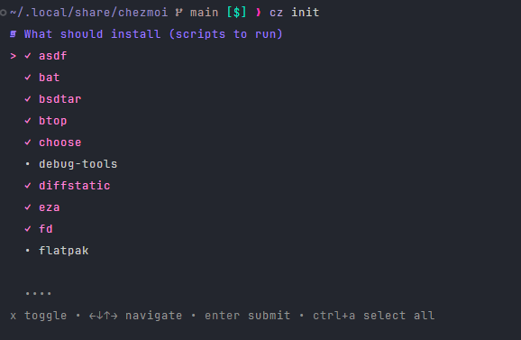

# My Dotfiles

> []
>
> A collection of my dotfiles, scripts, and configuration files managed by [chezmoi](https://www.chezmoi.io/).


<figure>
  
  <figcaption>ChezMoi execution</figcaption>
</figure>


## Installation

> [!TIP]
>
> Installing chezmoi
>
> ```sh
> # Install chezmoi
> sh -c "$(curl -fsLS get.chezmoi.io)" -- -b $HOME/.local/bin
> 
> # initialize chezmoi (without install)
> chezmoi init --apply https://github.com/ppcamp/dotfiles
> ```

> [!TIP]
>
> Avoid to use `snaps`, since they are much slower than native and flatpak, and
> often buggy.

> [!WARNING]
> Some scripts installed the whole tarball in those folders.

## Docs

1. [Apt packages](./docs/Apt%20Package%20Inspection.md)
2. [Chezmoi Commands](./docs/Chezmoi%20Commands.md)
3. [Discord Webhooks](./docs/Discord%20Webhooks.md)
4. [Git Config](./docs/Git%20Config.md)
5. [Kitty Config](./docs/Kitty.md)
6. [Zshrc Config](./docs/zshrc%20config.md)
7. [recommended programs](./docs/recommended_programs/README.md)

## Links
- [chezmoi dotfiles config]
- [chezmoi]

<!-- Links -->
[lazygit nvim plugins]: https://github.com/LazyVim/LazyVim/tree/main/lua/lazyvim/plugins
[chezmoi]: https://www.chezmoi.io/
[chezmoi dotfiles config]: https://fedoramagazine.org/take-back-your-dotfiles-with-chezmoi/
