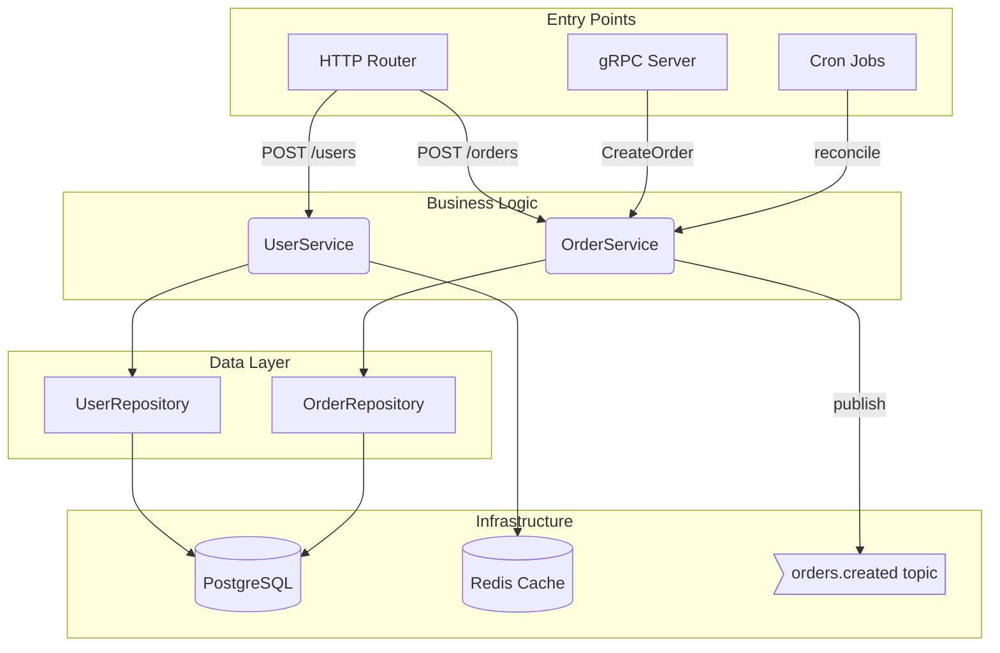

# Repo Documentation Skill

Generate `AI_DOCUMENTATION.md` in the repository root. The file must give a
future AI agent (or a new engineer) a complete picture of the codebase in one
read.

---

## Boundaries — strictly enforced

- **Scan only** the current working directory tree (`$PWD` and below).
- **Never read** files under:
  - `$HOME/go/` (Go module cache / GOPATH)
  - `vendor/` directories
  - Any path outside `$PWD`
- **For code analysis**: read top-level declarations only (function signatures,
  type definitions, interfaces, constants, exported vars). Do **not** trace
  function bodies to follow call chains into other packages/modules.
- **For imports**: list them for context, but do not open the imported packages.

---

## Execution Steps

### Step 1 — Discover the project

Run these commands from `$PWD`:

```sh
# Repository root files
ls -la

# Full directory tree (exclude common noise)
find . -type f \
  ! -path './.git/*' \
  ! -path './vendor/*' \
  ! -path './.idea/*' \
  ! -path './.vscode/*' \
  ! -path './node_modules/*' \
  ! -path '*/dist/*' \
  ! -path '*/build/*' \
  | sort

# Language/framework detection
# Go
find . -name 'go.mod' -not -path './vendor/*'
find . -name '*.go' -not -path './vendor/*' | head -60

# Node/JS/TS
find . -name 'package.json' -not -path '*/node_modules/*' | head -10
find . -name '*.ts' -o -name '*.tsx' -not -path '*/node_modules/*' | head -40

# Python
find . -name 'pyproject.toml' -o -name 'setup.py' -o -name 'requirements*.txt' | head -10
find . -name '*.py' | head -40

# Config / infrastructure
find . -name 'docker-compose*.yml' -o -name 'Dockerfile*' | head -10
find . -name '*.yaml' -o -name '*.yml' | grep -v '.git' | head -20
```

### Step 2 — Read project metadata

- `go.mod` / `package.json` / `pyproject.toml` — module name, dependencies
- `README.md` if present — one-paragraph summary only
- `Makefile` / `justfile` — available commands
- CI config (`.github/workflows/`, `.gitlab-ci.yml`) — test/deploy targets

### Step 3 — Map packages and modules

For each package/module directory found:

1. List all files and their exported symbols (functions, types, interfaces).
2. Note the package name / module name.
3. Identify what role the package plays:
   - `handler` / `controller` / `router` — HTTP or gRPC entry points
   - `service` / `usecase` — business logic
   - `repository` / `store` / `dao` — data access
   - `model` / `entity` / `domain` — data types
   - `middleware` — cross-cutting concerns
   - `queue` / `consumer` / `producer` — async messaging
   - `config` — configuration
   - `cmd` / `main` — entry points

**Read each file's declarations (not full body):**

```sh
# Go: read only declarations
grep -n '^\(func\|type\|var\|const\|package\)' path/to/file.go

# Go: exported symbols only
grep -n '^func [A-Z]\|^type [A-Z]\|^var [A-Z]\|^const [A-Z]' path/to/file.go

# TS: exported symbols
grep -n '^export\|^  export\|class \|interface \|function \|const \|type ' path/to/file.ts

# Python: class and function defs
grep -n '^class \|^def \|^async def ' path/to/file.py
```

### Step 4 — Find endpoints and queues

**HTTP endpoints:**
```sh
# Go — common patterns
grep -rn 'router\.\|mux\.\|http\.Handle\|\.GET(\|\.POST(\|\.PUT(\|\.DELETE(\|\.PATCH(' \
  --include='*.go' . | grep -v vendor

# Express/Fastify (TS/JS)
grep -rn 'app\.\(get\|post\|put\|delete\|patch\)\|router\.\(get\|post\|put\|delete\|patch\)' \
  --include='*.ts' --include='*.js' . | grep -v node_modules

# FastAPI/Flask (Python)
grep -rn '@app\.\|@router\.\|@blueprint\.' --include='*.py' .
```

**gRPC:**
```sh
find . -name '*.proto' | grep -v vendor
grep -rn 'RegisterServer\|pb\.' --include='*.go' . | grep -v vendor | head -20
```

**Message queues / event streams:**
```sh
# Common queue libraries
grep -rn 'kafka\|rabbitmq\|nats\|sqs\|pubsub\|amqp\|Publish\|Subscribe\|Consume\|Produce' \
  --include='*.go' --include='*.ts' --include='*.py' . \
  | grep -v vendor | grep -v node_modules | head -30
```

**Database:**
```sh
grep -rn 'sql\.\|sqlx\.\|gorm\.\|pgx\.\|mongo\.\|redis\.' \
  --include='*.go' . | grep -v vendor | head -20
```

### Step 5 — Build the diagrams

Produce three diagrams from the same component/layer model discovered in Steps 3–4. All three must represent the same architecture — derived from the same node set and edges.

Write each diagram to its own file, using the same base name as the main documentation file with a diagram-type suffix:

| Diagram | File |
|---------|------|
| Mermaid | `<docname>.mmd` |
| D2 | `<docname>.d2` |
| LikeC4 | `<docname>.c4` |

For example, if the main file is `AI_DOCUMENTATION.md`, write `AI_DOCUMENTATION.mmd`, `AI_DOCUMENTATION.d2`, and `AI_DOCUMENTATION.c4`.

The main documentation file references each diagram file by name (see Step 6) — do **not** embed the full diagram content inline.

#### 5a — Mermaid

Produce a `flowchart TD` diagram. Rules:

- **One node per meaningful component** (package / layer / external service).
- **Arrows show data flow** (request/response or event direction).
- **Label arrows** with the method/topic/table name when known.
- Group nodes with `subgraph` blocks by layer:
  - `subgraph ENTRY["Entry Points"]` — HTTP, gRPC, CLI, cron
  - `subgraph LOGIC["Business Logic"]` — services, use-cases
  - `subgraph DATA["Data Layer"]` — repositories, caches
  - `subgraph INFRA["Infrastructure"]` — DB, queue brokers, external APIs
- If the diagram would have >20 nodes, collapse related nodes into one labelled box and add a note.
- Use these shapes:
  - `[Name]` — generic component
  - `(Name)` — rounded = service/use-case
  - `{Name}` — diamond = decision/router
  - `[(Name)]` — cylinder = database/store
  - `>Name]` — flag = queue/topic

Example skeleton:



#### 5b — D2

Produce a D2 diagram (https://d2lang.com). Rules:

- Use nested containers to group by layer (same grouping as Mermaid).
- Use `shape: cylinder` for databases/caches, `shape: queue` for message queues.
- Label connections with the same method/topic/table names used in the Mermaid diagram.
- If the diagram would have >20 nodes, collapse layers into single containers.

Example skeleton:

```d2
ENTRY: Entry Points {
  HTTP: HTTP Router
  GRPC: gRPC Server
  CRON: Cron Jobs
}

LOGIC: Business Logic {
  UserSvc: UserService
  OrderSvc: OrderService
}

DATA: Data Layer {
  UserRepo: UserRepository
  OrderRepo: OrderRepository
}

INFRA: Infrastructure {
  PG: PostgreSQL {shape: cylinder}
  Redis: Redis Cache {shape: cylinder}
  KafkaTopic: orders.created {shape: queue}
}

ENTRY.HTTP -> LOGIC.UserSvc: POST /users
ENTRY.HTTP -> LOGIC.OrderSvc: POST /orders
ENTRY.GRPC -> LOGIC.OrderSvc: CreateOrder
ENTRY.CRON -> LOGIC.OrderSvc: reconcile
LOGIC.UserSvc -> DATA.UserRepo
LOGIC.OrderSvc -> DATA.OrderRepo
LOGIC.OrderSvc -> INFRA.KafkaTopic: publish
DATA.UserRepo -> INFRA.PG
DATA.OrderRepo -> INFRA.PG
LOGIC.UserSvc -> INFRA.Redis
```

#### 5c — LikeC4

Produce a LikeC4 diagram (https://likec4.dev). Rules:

- Use `specification` to declare element kinds used.
- Use `model` to define the system hierarchy with the same components as the other diagrams.
- Use `rel` (or `->`) for relationships, labelled with method/topic/table.
- Use the `views` block with at least one view named `index` that includes `*`.
- Map layers to C4-style element kinds: `system` → entry/service groupings, `component` → individual packages, `database` → data stores, `queue` → message queues.

Example skeleton:

```likec4
specification {
  element system
  element component
  element database
  element queue
}

model {
  system entry "Entry Points" {
    component http "HTTP Router" {
      technology "HTTP"
    }
    component grpc "gRPC Server" {
      technology "gRPC"
    }
    component cron "Cron Jobs" {
      technology "Cron"
    }
  }

  system logic "Business Logic" {
    component userSvc "UserService" {
      technology "Go"
    }
    component orderSvc "OrderService" {
      technology "Go"
    }
  }

  system data "Data Layer" {
    component userRepo "UserRepository"
    component orderRepo "OrderRepository"
  }

  database postgres "PostgreSQL" {
    technology "PostgreSQL"
  }
  database redis "Redis Cache" {
    technology "Redis"
  }
  queue kafkaTopic "orders.created" {
    technology "Kafka"
  }

  entry.http -> logic.userSvc "POST /users"
  entry.http -> logic.orderSvc "POST /orders"
  entry.grpc -> logic.orderSvc "CreateOrder"
  entry.cron -> logic.orderSvc "reconcile"
  logic.userSvc -> data.userRepo
  logic.orderSvc -> data.orderRepo
  logic.orderSvc -> kafkaTopic "publish"
  data.userRepo -> postgres
  data.orderRepo -> postgres
  logic.userSvc -> redis
}

views {
  view index {
    title "System Overview"
    include *
  }
}
```

### Step 6 — Write AI_DOCUMENTATION.md

Write the file to `$PWD/AI_DOCUMENTATION.md` with this exact structure:

```markdown
# AI Documentation — <project name>

> Auto-generated on <date>. Do not edit manually — regenerate with `/repo-doc`.

## Overview

<2–4 sentences: what the system does, its primary users, and the tech stack.>

## Tech Stack

| Layer | Technology |
|-------|-----------|
| Language | Go 1.22 / TypeScript 5 / Python 3.12 |
| Framework | Gin / Express / FastAPI |
| Database | PostgreSQL 16 |
| Cache | Redis 7 |
| Broker | Kafka / RabbitMQ / NATS |
| Deploy | Docker / Kubernetes |

## Repository Layout

\`\`\`
<annotated tree — one-line description per directory>
\`\`\`

## Package / Module Map

For each package found, one entry:

### `<package path>`

**Role:** <handler | service | repository | model | middleware | queue | config | cmd>
**Exported symbols:** `FuncA`, `TypeB`, `InterfaceC`
**Depends on:** `<local packages only>`

## Endpoints

### HTTP

| Method | Path | Handler | Description |
|--------|------|---------|-------------|

### gRPC

| Service | Method | Handler | Description |
|---------|--------|---------|-------------|

### Queue / Events

| Topic / Queue | Direction | Handler | Description |
|---------------|-----------|---------|-------------|

## Data Flow Diagram

Diagrams are stored in separate files sharing the same base name as this document:

| Format | File |
|--------|------|
| Mermaid | [`<docname>.mmd`](./<docname>.mmd) |
| D2 | [`<docname>.d2`](./<docname>.d2) |
| LikeC4 | [`<docname>.c4`](./<docname>.c4) |

## Key Data Models

For each significant struct/class/entity, one table:

### `<TypeName>`

| Field | Type | Description |
|-------|------|-------------|

## Configuration

How to configure the app: env vars, config files, feature flags.

| Variable | Default | Description |
|----------|---------|-------------|

## Entry Points

| Command / Binary | Purpose |
|-----------------|---------|

## External Dependencies

List only direct runtime dependencies (from go.mod / package.json / requirements.txt),
grouped by category (DB drivers, HTTP clients, messaging, auth, observability).

## Gaps / Unknowns

List any package, file, or pattern the skill could not classify.
```

---

## Quality Rules

- All section headers must be present. If a section has no data (e.g., no gRPC), write `None found.`
- All three diagrams (Mermaid, D2, LikeC4) must be syntactically correct. Test mentally: every node referenced in an edge must be declared, and all three diagrams must reflect the same architecture.
- The Mermaid diagram must compile without errors. Test mentally by ensuring every node referenced in an edge is declared.
- The D2 diagram must use valid D2 syntax: nested containers with `.` for path references in connections.
- The LikeC4 diagram must include a `specification` block, a `model` block, and a `views` block with at least one view.
- Each diagram is written to its own file (`<docname>.mmd`, `<docname>.d2`, `<docname>.c4`). Do **not** embed diagram content inline in the main `.md` file.
- Do not include file contents — only signatures and metadata.
- Do not include any path outside `$PWD`.
- The main `.md` file must be self-contained except for the diagram files: a reader with no other context must understand the system.
- Keep the main `.md` file under 600 lines. Summarize ruthlessly if needed.

---

## After Writing

Report to the user:

```
AI_DOCUMENTATION.md written — <N> packages, <M> endpoints, <K> queue topics mapped.
Diagrams: <N> nodes, <M> edges → AI_DOCUMENTATION.mmd, AI_DOCUMENTATION.d2, AI_DOCUMENTATION.c4
```

If any package was skipped (unrecognized pattern, generated code, etc.), list them briefly.
